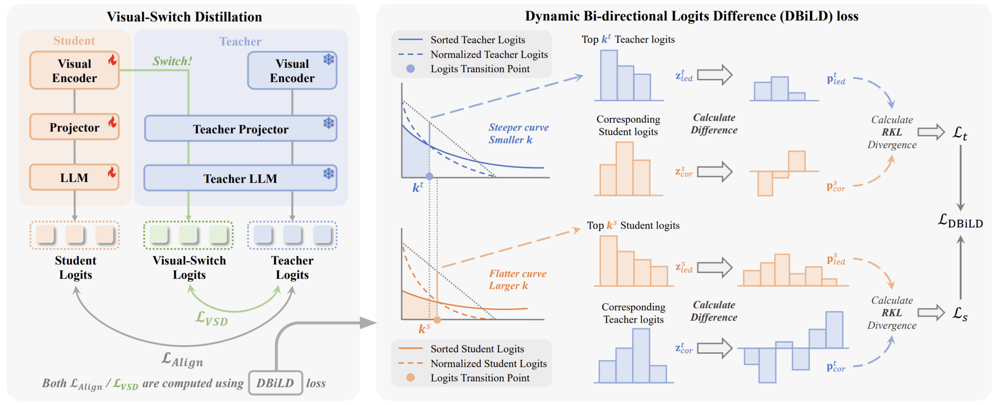

<div align="center">
<h1>Switch-KD</h1>
<h3>Visual-Switch Knowledge Distillation for Vision-Language Models</h3>

Haoyi Sun<sup>✉</sup>, Xiaoxiao Wang, Ning Mao, Qian Wang, Lifu Mu, Wen Zheng, Tao Wei, Wei Chen

Li Auto Inc.

✉ Corresponding author

IEEE/CVF Conference on Computer Vision and Pattern Recognition (CVPR) Findings, 2026

<a href="https://arxiv.org/abs/XXXX.XXXXX"></a>
<a href="https://your-username.github.io/Switch-KD/"></a>

</div>

---

## 📰 News

- **` 2026-04`:** Paper accepted to **CVPR Findings 2026**! 🎉
- More updates coming soon (code, model weights, demo...)

---

## 🎯 Overview

Vision-Language Models (VLMs) have shown remarkable capabilities in joint vision–language understanding, but their large scale poses significant challenges for deployment in resource-constrained scenarios. Knowledge Distillation (KD) offers a viable way to improve model capabilities without increasing model size, making deployment more efficient.

However, applying KD to VLMs is challenged by modality-specific supervision: although multimodal knowledge in VLMs is fused within the language space, current methods supervise each modality separately without explicitly addressing multimodal alignment, leading to inconsistent multimodal knowledge transfer.

To address this, we propose **Switch-KD**, a visual-switch distillation framework that unifies vision–language knowledge transfer within a shared text-probability space.

### Key Contributions

1. **Visual-Switch Distillation** — Switches the student's visual outputs into the teacher's language pathway to construct cross-modal probabilistic references for implicit visual knowledge transfer.

2. **Dynamic Bi-directional Logits Difference (DBiLD) Loss** — Adaptively aligns informative probability regions while preserving the distributional structures of teacher and student through bidirectional supervision using reverse KL divergence.

---

## 📊 Key Results

### Comparison with LLaVA-KD on 10 Benchmarks

**Results on 10 Multimodal Benchmarks - Switch-KD vs. LLaVA-KD (0.5B Models)**

<table>
<thead>
<tr>
<th rowspan="2" style="border: 1px solid #ddd; padding: 8px; text-align: center;">Method</th>
<th colspan="3" style="border: 1px solid #ddd; padding: 8px; text-align: center;">Perception & Understanding</th>
<th colspan="4" style="border: 1px solid #ddd; padding: 8px; text-align: center;">Cognition & Reasoning</th>
<th colspan="3" style="border: 1px solid #ddd; padding: 8px; text-align: center;">Other</th>
<th rowspan="2" style="border: 1px solid #ddd; padding: 8px; text-align: center;">Avg</th>
</tr>
<tr>
<th style="border: 1px solid #ddd; padding: 6px; font-size: 0.9em; text-align: center;">MME</th>
<th style="border: 1px solid #ddd; padding: 6px; font-size: 0.9em; text-align: center;">MMB</th>
<th style="border: 1px solid #ddd; padding: 6px; font-size: 0.9em; text-align: center;">MMB<sup>CN</sup></th>
<th style="border: 1px solid #ddd; padding: 6px; font-size: 0.9em; text-align: center;">VQA</th>
<th style="border: 1px solid #ddd; padding: 6px; font-size: 0.9em; text-align: center;">GQA</th>
<th style="border: 1px solid #ddd; padding: 6px; font-size: 0.9em; text-align: center;">SciQA</th>
<th style="border: 1px solid #ddd; padding: 6px; font-size: 0.9em; text-align: center;">MMMU</th>
<th style="border: 1px solid #ddd; padding: 6px; font-size: 0.9em; text-align: center;">Text</th>
<th style="border: 1px solid #ddd; padding: 6px; font-size: 0.9em; text-align: center;">VizWiz</th>
<th style="border: 1px solid #ddd; padding: 6px; font-size: 0.9em; text-align: center;">POPE</th>
</tr>
</thead>
<tbody>
<tr>
<td style="border: 1px solid #ddd; padding: 8px; text-align: center; font-weight: bold;">TinyLLaVA</td>
<td style="border: 1px solid #ddd; padding: 8px; text-align: center;">61.5</td>
<td style="border: 1px solid #ddd; padding: 8px; text-align: center;">58.9</td>
<td style="border: 1px solid #ddd; padding: 8px; text-align: center;">54.2</td>
<td style="border: 1px solid #ddd; padding: 8px; text-align: center;">74.8</td>
<td style="border: 1px solid #ddd; padding: 8px; text-align: center;">58.3</td>
<td style="border: 1px solid #ddd; padding: 8px; text-align: center;">59.1</td>
<td style="border: 1px solid #ddd; padding: 8px; text-align: center;">33.6</td>
<td style="border: 1px solid #ddd; padding: 8px; text-align: center;">49.2</td>
<td style="border: 1px solid #ddd; padding: 8px; text-align: center;">28.9</td>
<td style="border: 1px solid #ddd; padding: 8px; text-align: center;">86.1</td>
<td style="border: 1px solid #ddd; padding: 8px; text-align: center;">56.5</td>
</tr>
<tr>
<td style="border: 1px solid #ddd; padding: 8px; text-align: center;">LLaVA-KD</td>
<td style="border: 1px solid #ddd; padding: 8px; text-align: center;">64.7</td>
<td style="border: 1px solid #ddd; padding: 8px; text-align: center;">61.3</td>
<td style="border: 1px solid #ddd; padding: 8px; text-align: center;">57.0</td>
<td style="border: 1px solid #ddd; padding: 8px; text-align: center;">77.7</td>
<td style="border: 1px solid #ddd; padding: 8px; text-align: center;">59.8</td>
<td style="border: 1px solid #ddd; padding: 8px; text-align: center;">60.6</td>
<td style="border: 1px solid #ddd; padding: 8px; text-align: center;">28.3</td>
<td style="border: 1px solid #ddd; padding: 8px; text-align: center;">52.0</td>
<td style="border: 1px solid #ddd; padding: 8px; text-align: center;">41.5</td>
<td style="border: 1px solid #ddd; padding: 8px; text-align: center;">86.4</td>
<td style="border: 1px solid #ddd; padding: 8px; text-align: center;">58.9</td>
</tr>
<tr>
<td style="border: 1px solid #ddd; padding: 8px; text-align: center; font-weight: bold;">Switch-KD</td>
<td style="border: 1px solid #ddd; padding: 8px; text-align: center;"><strong>66.8</strong></td>
<td style="border: 1px solid #ddd; padding: 8px; text-align: center;"><strong>63.5</strong></td>
<td style="border: 1px solid #ddd; padding: 8px; text-align: center;"><strong>57.8</strong></td>
<td style="border: 1px solid #ddd; padding: 8px; text-align: center;"><strong>79.6</strong></td>
<td style="border: 1px solid #ddd; padding: 8px; text-align: center;"><strong>61.6</strong></td>
<td style="border: 1px solid #ddd; padding: 8px; text-align: center;">57.9</td>
<td style="border: 1px solid #ddd; padding: 8px; text-align: center;">29.8</td>
<td style="border: 1px solid #ddd; padding: 8px; text-align: center;"><strong>52.3</strong></td>
<td style="border: 1px solid #ddd; padding: 8px; text-align: center;"><strong>44.9</strong></td>
<td style="border: 1px solid #ddd; padding: 8px; text-align: center;"><strong>87.3</strong></td>
<td style="border: 1px solid #ddd; padding: 8px; text-align: center;"><strong>60.1</strong></td>
</tr>
</tbody>
</table>

### Comparison with Align-KD on 6 Benchmarks

**Performance Comparison with Align-KD (1.5B Models)**

<table>
<thead>
<tr>
<th rowspan="2" style="border: 1px solid #ddd; padding: 8px; text-align: center;">Method</th>
<th colspan="6" style="border: 1px solid #ddd; padding: 8px; text-align: center;">Performance Metrics</th>
<th rowspan="2" style="border: 1px solid #ddd; padding: 8px; text-align: center;">Avg</th>
</tr>
<tr>
<th style="border: 1px solid #ddd; padding: 6px; font-size: 0.9em; text-align: center;">MME<sup>P</sup></th>
<th style="border: 1px solid #ddd; padding: 6px; font-size: 0.9em; text-align: center;">MMB</th>
<th style="border: 1px solid #ddd; padding: 6px; font-size: 0.9em; text-align: center;">GQA</th>
<th style="border: 1px solid #ddd; padding: 6px; font-size: 0.9em; text-align: center;">SciQA</th>
<th style="border: 1px solid #ddd; padding: 6px; font-size: 0.9em; text-align: center;">TextVQA</th>
<th style="border: 1px solid #ddd; padding: 6px; font-size: 0.9em; text-align: center;">POPE</th>
</tr>
</thead>
<tbody>
<tr>
<td style="border: 1px solid #ddd; padding: 8px; text-align: center;">MobileVLM V2</td>
<td style="border: 1px solid #ddd; padding: 8px; text-align: center;">1289.2</td>
<td style="border: 1px solid #ddd; padding: 8px; text-align: center;">55.9</td>
<td style="border: 1px solid #ddd; padding: 8px; text-align: center;">59.0</td>
<td style="border: 1px solid #ddd; padding: 8px; text-align: center;">64.5</td>
<td style="border: 1px solid #ddd; padding: 8px; text-align: center;">52.2</td>
<td style="border: 1px solid #ddd; padding: 8px; text-align: center;">86.1</td>
<td style="border: 1px solid #ddd; padding: 8px; text-align: center;">63.7</td>
</tr>
<tr>
<td style="border: 1px solid #ddd; padding: 8px; text-align: center;">Align-KD<sup>*</sup></td>
<td style="border: 1px solid #ddd; padding: 8px; text-align: center;">1303.8</td>
<td style="border: 1px solid #ddd; padding: 8px; text-align: center;">57.5</td>
<td style="border: 1px solid #ddd; padding: 8px; text-align: center;">60.1</td>
<td style="border: 1px solid #ddd; padding: 8px; text-align: center;">67.7</td>
<td style="border: 1px solid #ddd; padding: 8px; text-align: center;">53.1</td>
<td style="border: 1px solid #ddd; padding: 8px; text-align: center;">87.0</td>
<td style="border: 1px solid #ddd; padding: 8px; text-align: center;">65.1</td>
</tr>
<tr>
<td style="border: 1px solid #ddd; padding: 8px; text-align: center; font-weight: bold;">Switch-KD</td>
<td style="border: 1px solid #ddd; padding: 8px; text-align: center;"><strong>1411.5</strong></td>
<td style="border: 1px solid #ddd; padding: 8px; text-align: center;"><strong>68.4</strong></td>
<td style="border: 1px solid #ddd; padding: 8px; text-align: center;"><strong>61.9</strong></td>
<td style="border: 1px solid #ddd; padding: 8px; text-align: center;"><strong>71.6</strong></td>
<td style="border: 1px solid #ddd; padding: 8px; text-align: center;"><strong>57.0</strong></td>
<td style="border: 1px solid #ddd; padding: 8px; text-align: center;"><strong>87.5</strong></td>
<td style="border: 1px solid #ddd; padding: 8px; text-align: center;"><strong>69.5</strong></td>
</tr>
</tbody>
</table>

<p style="font-size: 0.9em; color: #666; margin-top: 10px;">
<sup>*</sup> Align-KD results are from the long instruction subset (3.6M samples). Switch-KD uses only 1.2M samples with a lighter backbone.
</p>

---

## 🔧 Method

<div align="center">

</div>

Switch-KD consists of two key components:

### 1. Visual-Switch Distillation

Switches the student's visual encoder outputs into the teacher's language pathway, creating a hybrid inference route where the teacher's powerful language modules interpret the student's visual features. This design enables implicit cross-modal knowledge transfer within the unified text-probability space without modifying the student's architecture.

**Key Insight**: If the student visual encoder learns meaningful representations, its visual features should be correctly interpreted and decoded by the teacher's language modules, enabling effective knowledge transfer through a simple switch mechanism.

### 2. DBiLD Loss

Dynamic Bi-directional Logits Difference loss adaptively aligns informative probability regions while preserving the distributional structures of both teacher and student:

- **Adaptive Top-K Selection**: Uses Kneedle algorithm to automatically find the optimal boundary between information-rich and long-tail regions, focusing on the most informative and confident predictions

- **Bidirectional Alignment**: Performs alignment from both teacher-guided and student-guided perspectives, ensuring comprehensive knowledge transfer by verifying confident predictions from both sides

- **Reverse KL Divergence**: Focuses on high-confidence regions for stable optimization, avoiding over-emphasis on noisy long-tail distributions and enabling more reliable knowledge transfer

---

## 📧 Contact

For questions and suggestions, please open an issue or contact:

- **Work**: [sunhaoyi@lixiang.com](mailto:sunhaoyi@lixiang.com)
- **Personal**: [haoyi199815@126.com](mailto:haoyi199815@126.com)

---

## 🙏 Acknowledgement

Switch-KD is built upon the following outstanding open-source works:

- [xtuner](https://github.com/InternLM/xtuner) — VLM Training Engine
- [TinyLLaVA](https://github.com/TinyLLaVA/TinyLLaVA_Factory) — Modularized Codebase for Small-scale VLMs
- [LLaVA-KD](https://github.com/Fantasyele/LLaVA-KD) —  Multi-stage Distillation Method for VLMs
- [Align-KD](https://github.com/fqhank/Align-KD) — Attention-guide Distillation Method for VLMs

---

## 📋 Citation

If you find Switch-KD is useful in your research or applications, please consider giving us a star 🌟 and citing it by the following BibTeX entry.

```bibtex
@inproceedings{sun2026switch,
  title={Switch-KD: Visual-Switch Knowledge Distillation for Vision-Language Models},
  author={Sun, Haoyi and Wang, Xiaoxiao and Mao, Ning and Wang, Qian and Mu, Lifu and Zheng, Wen and Wei, Tao and Chen, Wei},
  booktitle={IEEE/CVF Conference on Computer Vision and Pattern Recognition (CVPR) Findings},
  year={2026}
}
```